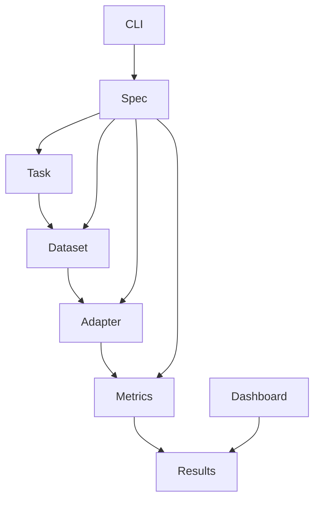

# OpenEval Lab 🚀

[](https://github.com/rajatsainju2025/openeval-lab/actions/workflows/ci-cd.yml)
[](https://github.com/rajatsainju2025/openeval-lab/actions/workflows/pr-checks.yml)
[](https://codecov.io/gh/rajatsainju2025/openeval-lab)
[](https://opensource.org/licenses/MIT)
[](https://www.python.org/downloads/)

> **State-of-the-art evaluation framework for LLMs, multimodal models, and AI agents with enterprise-grade reproducibility and extensibility.**

## 🎯 What Makes OpenEval Different

- **🔧 Plugin Architecture**: Extensible tasks, datasets, adapters, and metrics
- **📋 Declarative Specs**: JSON/YAML configs with version pinning and validation
- **🔄 Reproducibility**: Deterministic seeding, artifact logging, and manifest tracking
- **⚡ Performance**: Concurrent execution, caching, and optimization
- **📊 Rich Analytics**: Statistical analysis, bias detection, and uncertainty quantification
- **🌐 Modern UI**: Clean dashboard with real-time monitoring
- **🔒 Enterprise Ready**: Security scanning, comprehensive testing, and CI/CD

## 🚀 Quick Start

```bash
# Install with development dependencies
pip install -e '.[dev]'

# Run your first evaluation
openeval run examples/qa_spec.json --records --artifacts runs

# Launch the dashboard
openeval web --reload  # → http://localhost:8000

# Validate your environment
openeval doctor --json
```

**🎬 Want to see it in action?** Check out our [5-minute demo video](docs/demo.md) or try the [interactive tutorial](docs/tutorial.md).

## 📦 Installation Options

| Package | Description | Command |
|---------|-------------|---------|
| **Basic** | Core evaluation framework | `pip install -e .` |
| **Development** | Includes testing and linting tools | `pip install -e '.[dev]'` |
| **OpenAI** | OpenAI API adapter integration | `pip install -e '.[openai]'` |
| **Metrics** | Advanced metrics (BLEU, BERTScore, ROUGE) | `pip install -e '.[metrics]'` |
| **HuggingFace** | HF Datasets integration | `pip install -e '.[hf]'` |
| **Complete** | All optional dependencies | `pip install -e '.[all]'` |

## 🛠️ Essential Commands

```bash
# 🔍 Validation & Development
make install          # Install with dev dependencies
make test             # Run comprehensive test suite
make lint             # Check code quality
make format           # Auto-format code
make validate         # Validate examples and configurations

# 🏃 Evaluation Workflows
openeval run <spec>               # Execute evaluation
openeval validate <spec>          # Validate specification
openeval schema                   # Print JSON schema
openeval write_out <spec>         # Debug prompt rendering

# 📊 Analysis & Monitoring
openeval runs collect --dir runs    # Aggregate run results
openeval compare-runs A.json B.json # Statistical comparison
openeval analyze-bias <spec>        # Bias detection
openeval doctor                     # Environment diagnostics

# 🌐 Dashboard & Visualization
openeval web --reload              # Launch dashboard
```

## 🎯 Core Concepts

### Evaluation Specifications

OpenEval uses **declarative YAML/JSON specifications** for reproducible evaluations:

```yaml
# examples/qa_spec.yaml
task: qa
dataset:
  name: jsonl
  path: examples/qa_toy.jsonl
adapter:
  name: openai-chat
  model: gpt-4o-mini
metrics:
  - name: exact_match
  - name: bleu
    kwargs: {max_n: 4}
concurrency: 4
cache: rw
statistical: true
```

### Plugin Architecture

Extend OpenEval with custom components:

```python
# Custom metric example
from openeval.base import Metric

class CustomAccuracy(Metric):
    def compute(self, predictions, references, **kwargs):
        # Your custom logic here
        return {"accuracy": score}
```

## 🔬 Advanced Features

<details>
<summary><b>🤖 Multimodal & Agent Evaluation</b></summary>

- **Vision-Language Models**: `openeval run examples/multimodal_spec.json`
- **Agent Reasoning**: Multi-step tool usage and trajectory analysis
- **Interactive Evaluation**: Human-in-the-loop workflows

</details>

<details>
<summary><b>📈 Statistical Analysis</b></summary>

- **Bootstrap Confidence Intervals**: `--statistical` flag
- **Significance Testing**: `openeval compare-runs A.json B.json`
- **Bias Detection**: Automatic positional and prompt bias analysis
- **Uncertainty Quantification**: ECE, Brier Score, entropy metrics

</details>

<details>
<summary><b>🚀 Performance Optimization</b></summary>

- **Concurrent Execution**: `--concurrency N` for parallel requests
- **Smart Caching**: `--cache rw` with TTL and hit rate tracking
- **vLLM Integration**: High-throughput GPU inference
- **Request Optimization**: Retry logic and timeout handling

</details>

<details>
<summary><b>🔐 Enterprise Features</b></summary>

- **Cost Tracking**: Automatic API usage monitoring
- **Federated Evaluation**: Privacy-preserving distributed evaluation
- **Security Scanning**: Built-in vulnerability detection
- **Compliance**: Audit trails and manifest tracking

</details>

## 💡 Example Workflows

### Basic Question Answering
```bash
# Run QA evaluation with caching and statistical analysis
openeval run examples/qa_spec.json \
  --cache rw \
  --statistical \
  --records \
  --artifacts runs
```

### Advanced Metrics Comparison
```bash
# Install advanced metrics
pip install -e '.[metrics]'

# Run with multiple metrics
openeval run examples/qa_metrics_spec.json \
  --run-name "advanced-metrics" \
  --records \
  --artifacts runs

# Aggregate results for leaderboard
openeval runs collect --dir runs

# Launch dashboard
openeval web --reload  # → http://localhost:8000/leaderboard
```

### LLM-as-a-Judge Evaluation
```bash
# Set up OpenAI API
export OPENAI_API_KEY="your-key-here"
pip install -e '.[openai]'

# Run judge-based evaluation
openeval run examples/qa_judge_spec.json \
  --records \
  --artifacts runs
```

### Statistical Comparison
```bash
# Compare two evaluation runs
openeval compare-runs runs/model-a.json runs/model-b.json \
  --bootstrap 1000 \
  --alpha 0.05
```

### Bias Analysis
```bash
# Detect evaluation biases
openeval analyze-bias examples/qa_spec.json \
  --output-dir bias-analysis \
  --include-recommendations
```

## 🏗️ Architecture & Design

OpenEval follows a **clean plugin architecture** with four core abstractions:



- **📋 Task**: Defines the evaluation methodology (QA, summarization, etc.)
- **💾 Dataset**: Loads and validates evaluation data
- **🔌 Adapter**: Interfaces with models (OpenAI, local, vLLM)
- **📊 Metrics**: Computes performance measures
- **⚙️ Spec**: Declarative configuration for reproducibility

## 🔧 Development & Contributing

```bash
# Set up development environment
git clone https://github.com/rajatsainju2025/openeval-lab.git
cd openeval-lab
make install

# Run tests and validation
make test
make lint
make validate

# Create a new feature
git checkout -b feature/amazing-feature
# ... make changes ...
make test && make lint
git commit -m "feat: add amazing feature"
git push origin feature/amazing-feature
```

**📖 Development Guides:**
- [Contributing Guidelines](CONTRIBUTING.md)
- [Architecture Overview](docs/Architecture.md) 
- [Plugin Development](docs/concepts.md)
- [Testing Strategy](docs/testing.md)

## 🔄 Reproducibility & Best Practices

### Lockfiles and Manifests
```bash
# Generate lockfile from successful run
openeval lock --from runs/20250101-120000.json --out openeval-lock.json

# Run with locked dependencies
openeval run examples/qa_spec.json --lockfile openeval-lock.json
```

### Version Pinning
Every evaluation result includes:
- 🐍 Python version and platform info
- 📦 Exact package versions (requirements)
- 🔄 Git commit hash (when available)
- 🔢 Dataset and spec fingerprints
- 🎲 Random seed configuration

### Best Practices
- ✅ Always use `--records` for detailed analysis
- ✅ Enable `--statistical` for confidence intervals
- ✅ Use `--cache rw` to speed up development
- ✅ Set explicit random seeds for reproducibility
- ✅ Version your evaluation specs in git
- ✅ Use `--artifacts` to preserve all outputs

## 📚 Documentation Hub

| Section | Description | Link |
|---------|-------------|------|
| **🎓 Getting Started** | Tutorial and basic concepts | [docs/tutorial.md](docs/tutorial.md) |
| **🏗️ Architecture** | System design and patterns | [docs/Architecture.md](docs/Architecture.md) |
| **📋 Configuration** | Spec formats and options | [docs/configuration.md](docs/configuration.md) |
| **🔗 Contracts** | Plugin APIs and interfaces | [docs/contracts.md](docs/contracts.md) |
| **🚀 EvalOps** | Deployment and operations | [docs/evalops.md](docs/evalops.md) |
| **🎯 SOTA Methods** | Best practices and references | [docs/sota.md](docs/sota.md) |
| **🗺️ Roadmap** | Future plans and milestones | [docs/roadmap.md](docs/roadmap.md) |
| **📝 Research** | Academic paper and findings | [ICML_PAPER.md](ICML_PAPER.md) |

## ⚠️ OpenAI Usage & Costs

When using OpenAI adapters, be mindful of:
- 💰 **API Costs**: Monitor usage with built-in cost tracking
- ⏱️ **Rate Limits**: Use `--concurrency` and `--request-timeout` appropriately  
- 🔒 **API Keys**: Store securely and never commit to version control
- 📊 **Usage Analytics**: Review cost summaries in evaluation manifests

Example cost-aware configuration:
```yaml
adapter:
  name: openai-chat
  model: gpt-4o-mini  # Cost-effective option
  max_tokens: 100     # Limit response length
concurrency: 2        # Respect rate limits
request_timeout: 30   # Prevent hanging requests
```

## 🏆 Community & Support

- 🐛 **Bug Reports**: [GitHub Issues](https://github.com/rajatsainju2025/openeval-lab/issues)
- 💡 **Feature Requests**: [GitHub Discussions](https://github.com/rajatsainju2025/openeval-lab/discussions)
- 📋 **Project Board**: [GitHub Projects](https://github.com/rajatsainju2025/openeval-lab/projects)
- 📊 **Roadmap**: [10-Day Plan](docs/10-day-contribution-plan.md)

## 📄 License

MIT License - see [LICENSE](LICENSE) for details.

---

<div align="center">

**Built with ❤️ for the AI evaluation community**

[⭐ Star us on GitHub](https://github.com/rajatsainju2025/openeval-lab) • [📖 Read the Docs](docs/) • [🚀 Try the Demo](examples/)

</div>
